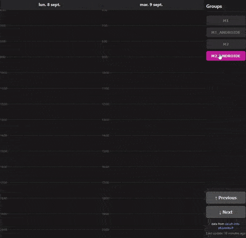

# Master Calendar Viewer

A two-part system designed to scrape a university's web-based calendar and display the events in a clean, mobile-friendly, dark-mode web interface. \
It was designed to circumvent the slow loading times of the original calendar page.

> A quick demo showing the interface and group filtering.
>
> 

## ✨ Features

*   **Automated Scraping:** A script navigates the calendar, and extracts event data for multiple groups.
*   **Mobile-First Dark Mode UI:** A clean, responsive interface designed for phone screens, providing a two-day timeline view.
*   **Dynamic Group Filtering:** Users can toggle which groups they want to see, with their preferences automatically saved in their browser for future visits.
*   **Multi-Day Navigation:** Users can navigate forward and backward through the calendar two days at a time.
*   **Data Freshness Alerts:** The interface monitors the age of the scraped data and visually alerts the user with a popup if it becomes stale, suggesting they check the original source.

## ⚙️ How It Works

This project uses a decoupled architecture to separate the slow data collection from the fast data presentation.

### 1. The Scraper (local)
This is a script that runs locally to scrape only the necessary calendar data and upload it.
*   **Technology:** Python

### 2. The Frontend Viewer (`index.html`, `style.css`, `script.js`)

This is a completely static web application hosted for free on GitHub. It has no backend server of its own.
*   **Technology:** HTML, CSS, Vanilla JavaScript.

## 🚀 Setup and Installation

No setup required! Just visit the page [here](https://YOUR_GITHUB_USERNAME.github.io/YOUR_REPOSITORY_NAME/) to view the calendar.

## 🗺️ Project Roadmap

### ✅ Achieved Goals
- [x] Core scraping logic.
- [x] Data persistence via API.
- [x] Clean, mobile-friendly dark mode user interface.
- [x] Client-side preference storage for group filters.
- [x] Dynamic timeline view with overlap management.
- [x] Multi-day navigation controls.
- [x] "Last updated" timestamp.
- [x] Popup alert for stale data.
- [x] Live "current time" indicator.

### 🚧 Future Goals (that I might never implement)
- [ ] **More groups:** Add more groups to the viewer.
- [ ] **Smart Day Fetching:** Instead of a fixed number of weeks, calculate how far ahead to scrape based on the last known event for each group.
- [ ] **Data Optimization:** Implement a check within the scraper to see if the calendar data has actually changed before making an API call to update the Gist, saving resources.
- [ ] **User-Selectable Themes:** Add a toggle for a light mode theme.
- [ ] **Search/Filter by Event Title:** Add an input field to filter the visible events by name.

## 📄 License
This project is open source and available under the [MIT License](LICENSE).